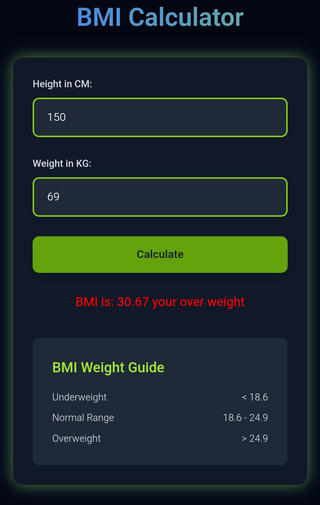

# BMI-calculator-
A sleek, modern BMI Calculator built with HTML, JavaScript, and Tailwind CSS. Features a responsive neon-themed UI, robust input validation, and color-coded BMI categories (Underweight, Normal, Overweight). Calculate your BMI instantly with a user-friendly interface, complete with animations and a weight guide.

A modern, responsive **BMI Calculator** built with HTML, JavaScript, and Tailwind CSS. This project allows users to calculate their Body Mass Index (BMI) by entering their height (in cm) and weight (in kg). It features a vibrant neon-themed UI, robust input validation, and color-coded BMI categories (Underweight, Normal, Overweight) with smooth animations.



## Live Demo
Check out the live demo [here](https://Paban-1.github.io/BMI-calculator-/)!

## Features
- **Responsive Design**: Works seamlessly on mobile, tablet, and desktop screens.
- **Neon-Themed UI**: Vibrant design with neon green, electric blue, and charcoal colors, built using Tailwind CSS.
- **Input Validation**: Ensures valid inputs (non-empty, positive numbers) with clear error messages.
- **BMI Categorization**: Displays BMI with categories:
  - Underweight (< 18.6, yellow)
  - Normal (18.6–24.9, lime)
  - Overweight (> 24.9, red)
- **Animations**: Smooth slide-in for the title, pulsating button, and ripple effect on click.
- **Weight Guide**: Includes a reference table for BMI ranges.
- **User-Friendly**: Intuitive form with color-coded results and bold category display.

## Technologies
- **HTML5**: Structure of the calculator.
- **JavaScript**: Handles BMI calculation, validation, and dynamic updates.
- **Tailwind CSS**: Styling with a custom neon theme (via CDN for simplicity).
- **Custom CSS**: Minimal styles for gradient text and glow effects.

## Setup
To run the project locally:

1. **Clone the Repository**:
   ```bash
   git clone https://paban-blip.github.io/BMI-calculator-/
   cd BMI-calculator-
